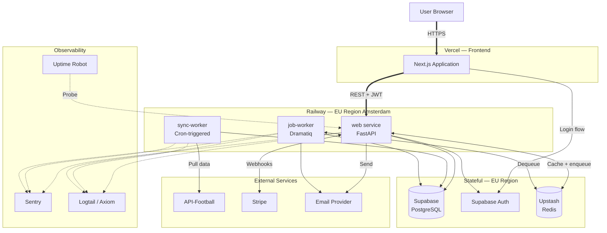
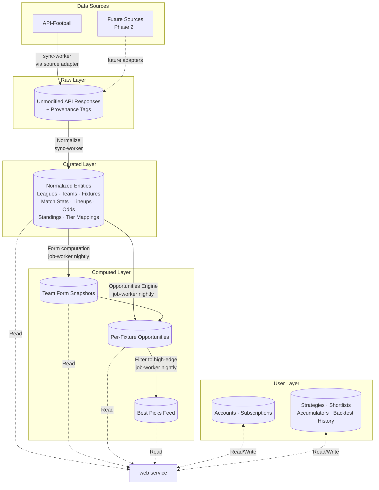

# Statesta — ARCHITECTURE.md

**Document version:** 1.0
**Session produced:** Session 3 — High-Level Architecture
**Date:** May 2026
**Status:** Authoritative architecture for Statesta; drives Session 4+ (Schema) and beyond

---

## 1. Purpose & Scope

### 1.1 What this document is

This is the **authoritative high-level architecture specification** for Statesta. It defines:

- The **services** that exist in the system and what each owns.
- The **data layers** and how data flows between them.
- The **architectural patterns** that recur across many places in the codebase.
- The **architectural decisions** resolved in this session (Q-002, Q-004, Q-NEW-G, Q-NEW-H at the architectural level).
- The **non-functional posture** — how the topology meets the targets set in REQUIREMENTS.md §8.

All downstream artifacts — schema, API design, implementation — must serve this architecture. If a future artifact conflicts with this document, this document wins and the conflict is raised as an open question. This is the same discipline REQUIREMENTS.md uses against itself.

### 1.2 What this document is not

It is deliberately not:

- **Schema** — no table designs, no column lists, no relationships. That is Session 4+.
- **API design** — no endpoint shapes, no request/response formats. Section 5 names services; later sessions design their interfaces.
- **Methodology** — no formulas, no coefficients, no statistical models. The Opportunities Engine has a place in the topology; its math is engineering work for a later session.
- **Implementation** — no language-specific code, no library configuration, no deployment YAML. Section 9 names the deployment shape; the actual configuration is engineering work.
- **Product or UI design** — no screen layouts, no flows, no tab inventories. That work is scoped against REQUIREMENTS.md §9 and belongs to Stratos.

If a question is *"what does this database table look like?"* or *"what is the methodology coefficient for corners?"* — it does not belong here.

### 1.3 How to read this document

The document is **diagram-heavy by design.** REQUIREMENTS.md has already done the exhaustive work of specifying *what* the platform must do. This document focuses on *how the system is shaped* to do those things.

Prose sections explain *why* each piece exists and *what it owns*. Mermaid diagrams handle *how connections are made*. If you want to understand the platform's shape quickly, the diagrams in §3 (topology) and §4 (data flow) are the right place to start.

### 1.4 Audience

Primary readers:

- **Alex (architect/developer):** uses this document to drive Session 4+ schema decisions and to push back when implementation creeps outside the architectural shape.
- **Future-Claude (architect chat):** uses this document as the authoritative reference for schema, API design, and implementation sessions.
- **Claude Code (engineer):** uses the architectural shape to constrain implementation.

Not in the audience: end users, marketing, investors. Don't write for them here.

### 1.5 Relationship to REQUIREMENTS.md

REQUIREMENTS.md is the *what*. ARCHITECTURE.md is the *how the system is shaped*. They are siblings, not parent/child. Both are authoritative within their respective scopes:

- A requirement change cascades into this document if it affects topology.
- An architectural change cascades into REQUIREMENTS.md only if it changes what the platform does (rare; usually changes are invisible to users).
- When in doubt, REQUIREMENTS.md is the upstream source: this document serves the requirements, not the other way around.

---

## 2. Architectural Commitments

Five commitments are load-bearing. Everything in this document and every downstream session must respect them. They come directly from REQUIREMENTS.md decisions but are restated here in architectural terms because they shape the rest of the document.

### 2.1 Configuration, not code (D-037)

**The commitment:** every gating value, limit, threshold, label, methodology coefficient, retention window, tab availability, rate limit is **runtime configuration stored in the database**, never hardcoded in application code.

**Why this is load-bearing:** if any of these values live in code, adjusting them requires a deploy. Deploys are slow, risky, and serial. A SaaS platform with hardcoded pricing cannot run a pricing experiment. A platform with hardcoded methodology coefficients cannot tune the engine without releasing software. A free trial whose length lives in code is not adjustable per cohort.

**What this means architecturally:**

- The system contains a **Configuration Layer** — a small, fast-read, admin-writable subsystem holding all these values.
- Every service reads from this layer at request time (with appropriate caching to avoid hammering the database).
- Changes propagate without redeploy.
- The Configuration Layer itself is auditable — every change records who, when, and what changed.
- Configuration is **structured**, not free-form: typed values, validated ranges, namespaced keys (e.g., `limit.saved_strategies.paid_pro`, `methodology.corners.weight.recent_form`).

This is the single most consequential constraint on the rest of the document. Many design choices later in this document are direct consequences of it.

### 2.2 Pre-computation over real-time calculation

**The commitment:** heavy analytical work (team form snapshots, per-fixture opportunities, KPIs) is computed once in the background and stored. User-facing reads are indexed lookups, not computations.

**Why this is load-bearing:** REQUIREMENTS.md §4.1.9 requires <3s p95 for typical filter analysis. That target is unachievable if the platform computes form-from-fixtures at request time. The only path to those numbers is pre-compute and look up.

**What this means architecturally:**

- The data model has a **Computed Layer** distinct from raw and curated layers (§4).
- The system runs **batch compute workflows** on a schedule (nightly, primarily) to refresh the Computed Layer.
- User-facing read paths query the Computed Layer first; they fall back to live compute only for rare or ad-hoc requests where staleness matters.
- The Computed Layer is **regenerable from the layers below it** — losing it is recoverable, just expensive in compute time.

### 2.3 Async execution for heavy workloads

**The commitment:** any workload that can take longer than a normal HTTP request — backtests, opportunities recomputation, GDPR data exports, historical odds backfill — runs as a **background job** with queue, progress, persistence, and tier-based priority. Never blocks the request thread.

**Why this is load-bearing:** REQUIREMENTS.md §4.3.13 calls this out explicitly: synchronous backtests are *operationally dangerous*. A single user submitting a heavy backtest can saturate a web server and crater user-facing latency for everyone. The queue is a hard requirement, not an optimization.

**What this means architecturally:**

- A dedicated **job-worker service** exists, separate from the web/API service.
- A **queue** (Redis) holds pending work.
- Jobs survive worker restarts — both the queue and the job state persist outside the worker process.
- Submitters receive a job ID and poll for progress; they do not wait synchronously.
- Priority is tier-aware: paid users' jobs dequeue first; within a tier, FIFO.

### 2.4 Multi-sport readiness (D-039)

**The commitment:** every plausibly sport-specific entity carries a `sport` identifier (default `'football'`). MVP queries filter to football. Adding a second sport in the future does not require schema migration.

**Why this is load-bearing:** the alternative — assuming football everywhere and retrofitting sport-awareness later — is a massive rewrite affecting every engine, every query, every API endpoint. Doing this upfront costs almost nothing.

**What this means architecturally:**

- Schema (Session 4+) attaches `sport` to leagues, teams, fixtures, statistics, lineups, odds, opportunities — every entity whose meaning depends on sport.
- Application code reads sport as a first-class scope parameter, even when only one value is ever passed at MVP.
- Engines (filter, backtest, opportunities) accept sport as input even when their initial implementations only handle football.
- Sport-agnostic entities (users, subscriptions, saved strategies, search history, feature flags) do not need the identifier.

### 2.5 Multi-source readiness (D-041)

**The commitment:** the data ingestion layer is **pluggable**. API-Football is the source at launch, but the architecture does not hardcode that. Adding a second data source (a dedicated odds provider, a different statistics provider) means writing a new source adapter, not refactoring the sync engine.

**Why this is load-bearing:** rate limits, outages, or pricing changes at a single data source could threaten the platform. Multi-source readiness is operational risk mitigation. REQUIREMENTS.md §6.8 also commits to provenance tracking — every record knows which source it came from.

**What this means architecturally:**

- The sync engine has a **source-adapter interface**; each adapter (API-Football for MVP, others later) implements it.
- The data model tags each record with **provenance** (source identifier + retrieval timestamp).
- Conflict resolution rules — what happens when two sources disagree about the same fact — are configuration, deferred to Phase 2 (Q-NEW-V). The architecture leaves room for them but does not implement them at MVP.

---

## 3. System Topology

### 3.1 Overview

Statesta runs as **three logical tiers** spread across managed platforms:

- **Frontend tier** — a Next.js application hosted on Vercel, served from edge locations close to users.
- **Backend tier** — three services running on Railway in a single EU region (Amsterdam): a `web` service for user requests, a `sync-worker` service for scheduled data ingestion, and a `job-worker` service for asynchronous job processing.
- **Stateful tier** — managed services: PostgreSQL via Supabase (EU region), Redis via Upstash (EU region), authentication via Supabase Auth.

External services — API-Football for data, Stripe for payments, a transactional email provider, and an observability stack — connect into this topology at well-defined points.

This shape is deliberately small. Three Railway services is the minimum that respects the Shape B commitment (web tier separated from worker pools per REQUIREMENTS.md §8.2). Adding more services later is cheap; reducing complexity later is not. Starting at the right level matters.

### 3.2 System at a glance

### 3.3 Where each piece lives

| Component | Host | Purpose |
|---|---|---|
| Next.js frontend | Vercel | Renders user interface; calls backend API |
| `web` service | Railway (EU) | FastAPI; serves user-facing API; enqueues background jobs; handles Stripe webhooks |
| `sync-worker` service | Railway (EU) | Pulls data from API-Football on cron triggers; writes to Raw and Curated layers |
| `job-worker` service | Railway (EU) | Consumes Dramatiq queue; runs backtests, opportunities computation, GDPR exports |
| PostgreSQL | Supabase (EU) | Primary database; all data layers live here |
| Supabase Auth | Supabase (EU) | User authentication; OAuth; session management |
| Redis | Upstash (EU) | Cache; Dramatiq queue broker; rate limit counters |
| API-Football | External (US-based) | Data source; pulled by sync-worker only |
| Stripe | External | Payment processing; checkout, billing portal, webhooks |
| Transactional email | Resend or Postmark | Verification, password reset, receipts |
| Sentry, Logtail, Uptime Robot | External | Errors, logs, uptime probes |

### 3.4 Communication patterns

Five patterns appear repeatedly across the system:

- **HTTPS request/response** — browser to Vercel, Vercel to Railway, Railway to Stripe, Railway to API-Football, Railway to email provider. The default for most interactions.
- **Internal private network (Railway)** — `web`, `sync-worker`, and `job-worker` talk to each other and to shared infrastructure (Redis, Postgres) over Railway's internal network. Faster and more secure than the public internet.
- **Webhooks** — Stripe pushes subscription state changes to a dedicated webhook endpoint on the `web` service. Webhook handlers must be idempotent (Stripe may retry).
- **Queue (Redis)** — `web` enqueues jobs; `job-worker` dequeues. Jobs are durable; survive worker restarts.
- **Cron triggers (Railway)** — scheduled commands fire on configured times. Used for the sync workloads (nightly master sync, daily odds, lineup syncs every 3–4 hours, weekly player stats).

### 3.5 Why this shape

A few specific choices are worth flagging because they shape every downstream session:

- **Single region (EU/Amsterdam)** — Users are mostly in Europe (Q-002 resolution). Multi-region complexity buys nothing today. If global expansion happens later, Railway and Supabase both support multi-region; migration is feasible, not free.
- **Three Railway services, not one** — Shape B from day one. Sync workload and user-facing requests do not compete for the same machine. Workers scale independently.
- **PostgreSQL via Supabase, not self-hosted** — Auth, RLS, backups, point-in-time recovery, and admin UI come bundled. Saves weeks of operational work (D-001).
- **Redis via Upstash, not self-hosted** — Managed Redis with pay-as-you-go pricing means cache and queue broker scale with usage, not provisioning.
- **No DuckDB at launch** — The analytical layer is deferred (D-002). Postgres handles the first hundreds of users comfortably given pre-computation. DuckDB enters the picture only when measured to be needed.

---

## 4. Data Layers & Data Flow

### 4.1 The four data layers

Statesta organizes data into four logical layers, each with a distinct responsibility:

| Layer | Purpose | Mutability |
|---|---|---|
| **Raw Layer** | Unmodified API responses from data sources, provenance-tagged | Append-only |
| **Curated Layer** | Normalized, application-shaped entities derived from raw responses | Updateable |
| **Computed Layer** | Pre-computed analytics: form snapshots, opportunities, Best Picks | Regenerable |
| **User Layer** | User-private data: accounts, subscriptions, strategies, shortlists, accumulators, backtest history, search history | User-owned |

A fifth subsystem — the **Configuration Layer** — exists alongside these but is not part of the data flow. It holds runtime knobs (gates, limits, methodology coefficients, tier mappings). It is described separately in §4.6.

All five live in the same PostgreSQL database at MVP. They are separated by **schema, not by physical database**. Splitting them across separate databases is a future-proofing option that does not need to happen at launch.

### 4.2 Data flow

Reading top to bottom:

- **External data sources** feed into the **Raw Layer** via source adapters. The sync-worker service runs these adapters on schedule.
- The **Raw Layer** is normalized into the **Curated Layer** by a transformation step. This step runs immediately after a sync completes, often as part of the sync itself.
- The **Curated Layer** is the input to the **Computed Layer**. Form snapshots, opportunities, and Best Picks are computed from curated entities nightly (and on-demand for some triggers).
- The **User Layer** is independent of the others. It holds what users have created and their billing state. It reads from the Curated and Computed layers but never the other way around — the analytical layers know nothing about specific users.
- The **`web` service** reads from Curated, Computed, and User layers to serve user requests. It writes to the User layer only. It never writes to Raw, Curated, or Computed.

### 4.3 Each layer in detail

**Raw Layer**

- Stores unmodified API responses (or close-to-unmodified — light wrapping for provenance/timestamps is acceptable).
- Every record tagged with: source identifier, retrieval timestamp, request parameters, source response version.
- **Retention: indefinite.** Cold archival after 12 months is acceptable (D-040).
- Enables: replayability (rebuild Curated and Computed from raw if needed), audit (prove what the source said at a specific time), methodology re-runs (apply a new methodology to old data).
- Written only by: sync-worker.
- Read by: sync-worker (for incremental sync diffing), admin tooling.

**Curated Layer**

- Application-shaped entities: leagues, teams, fixtures, match statistics, lineups, player match stats, odds (across markets and lines), standings, tier mappings.
- One canonical record per entity (deduplicated, normalized).
- **Provenance preserved on each record** — which source(s) contributed, when last updated.
- Multi-sport ready — every entity that needs it carries the `sport` identifier.
- Written by: sync-worker (after Raw → Curated transformation).
- Read by: `web` service, `job-worker`, Computed Layer regeneration.

**Computed Layer**

- Pre-computed analytical outputs:
  - **Team form snapshots** — per team, per as-of date, per tier scope. Avoids recomputation at filter-evaluation time (D-016).
  - **Per-fixture opportunities** — per fixture, per market, computed by the Opportunities Engine (D-030). Versioned by methodology (§6.3).
  - **Best Picks feed** — derived from opportunities filtered to high-edge across upcoming fixtures.
- **Regenerable.** Losing the Computed Layer is recoverable by recomputing from the Curated Layer. Expensive in compute time, not in data integrity.
- Written by: `job-worker` (nightly batch + on-demand triggers).
- Read by: `web` service.

**User Layer**

- All user-owned data: account profiles, subscription state, saved strategies, shortlists, accumulators, backtest history, search history.
- **Row Level Security enforced** at the database layer — users can only see their own data. The service role used by the backend bypasses RLS for legitimate admin work; the anon key respects it for frontend reads.
- Written by: `web` service (on behalf of authenticated users), `job-worker` (for jobs that produce user-private outputs like backtest results).
- Read by: `web` service, `job-worker`.

### 4.4 Layer access matrix

Who can write to and read from each layer:

| Layer | Written by | Read by |
|---|---|---|
| Raw | sync-worker | sync-worker, admin tooling |
| Curated | sync-worker | web, job-worker |
| Computed | job-worker (batch + on-demand) | web |
| User | web, job-worker | web, job-worker |
| Configuration | admin (via web), config tooling | web, job-worker, sync-worker |

The asymmetries here matter:

- **`web` never writes to Raw, Curated, or Computed.** This is enforced architecturally — user-facing requests cannot corrupt analytical data.
- **`sync-worker` never writes to User.** Sync workers operate on a service credential that has no access to user-private tables. Enforced at the database level (RLS + role isolation per REQUIREMENTS.md §2.6).
- **`job-worker` writes to both User and Computed**, because it produces user-private artifacts (backtest results) and platform-wide artifacts (opportunities). It does not write to Raw or Curated.

### 4.5 Cadences and freshness

| Data category | Cadence | Trigger |
|---|---|---|
| New fixtures, standings, match stats | Nightly | Railway cron → sync-worker |
| Odds (pre-match) | Daily morning + intraday on match days | Railway cron → sync-worker |
| Lineups | Every 3–4 hours on match days | Railway cron → sync-worker |
| Player stats | Weekly | Railway cron → sync-worker |
| Form snapshots | Nightly, after match stats sync | Job-worker batch job, chained from sync completion |
| Opportunities | Nightly, after form snapshots | Job-worker batch job, chained |
| Best Picks | Nightly, after opportunities | Job-worker batch job, chained |
| Historical odds backfill | One-time pre-launch | Job-worker, manually triggered |
| Backtest jobs | On-demand | User submission → web → Dramatiq queue → job-worker |
| Opportunities on-demand recompute | On-demand | Admin trigger or after major data correction |

Cadences are **dependency-aware**: form snapshots depend on completed match stats sync; opportunities depend on completed form snapshots; Best Picks depends on completed opportunities. Failure in an upstream step blocks downstream computation and surfaces in admin observability.

### 4.6 The Configuration Layer

Separate from the four data layers because it does not participate in the data flow. The Configuration Layer holds the runtime knobs that make D-037 work.

**What lives here:**

- **Gating values** — feature/filter access per tier, quantitative limits per tier (saved strategies count, shortlist size, backtest retention), rate limits per endpoint per tier.
- **Methodology configuration** — coefficients, sample sizes, weighting factors, edge thresholds. Versioned (a methodology version identifier stamps every Computed Layer output).
- **Tier mapping configuration** — which leagues map to which tiers, auto-scoring suggestions, admin overrides, audit log.
- **Operational configuration** — retention windows, backup cadences, cache TTLs.
- **Feature flags** — toggle entire features on/off for rollouts.

**What does NOT live here:**

- Per-user state (that's User Layer).
- Per-fixture analytical output (that's Computed Layer).
- Source data (that's Raw and Curated).
- Code logic. The Configuration Layer holds values, not behavior.

**Access pattern:**

- **Read-heavy.** Every authenticated request likely reads several configuration values (tier limits, gating flags, methodology version).
- **Cached aggressively** in Redis with short TTL (1–5 minutes), so admin changes propagate within minutes without code deploy.
- **Writes are rare** and admin-only. Every write logged with who/when/what.

Schema design for the Configuration Layer is Session 4+ work. What architecture commits to today:

- The Configuration Layer is a **first-class subsystem**, not an afterthought.
- Every service that needs configuration reads from it; no service hardcodes gating values.
- Configuration values are **typed and validated** — a numeric limit cannot be set to a string; a rate limit cannot be negative.
- The Configuration Layer has its own **versioning mechanism for methodology** so historical Computed Layer outputs stay traceable even after methodology changes.

---

## 5. Service Decomposition

### 5.1 Why decomposition matters

REQUIREMENTS.md §8.2 commits to stateless application servers and independently scalable worker pools. The three-service Shape B from §3 honors this. This section spells out **what each service owns and what it does not** — the boundaries.

The discipline matters because services drift toward doing too much. A `web` service that quietly grows a "let me just run this small sync inline" code path eventually competes with itself for resources and breaks the asynchronous-execution commitment. Naming the boundaries up front makes drift visible.

### 5.2 The `web` service

**Owns:**

- Serving every user-facing HTTP request.
- Authenticating users (validating JWTs issued by Supabase Auth).
- Authorizing requests (checking tier gating server-side — §6.2).
- Reading from Curated, Computed, and User layers.
- Writing to the User layer.
- Reading from the Configuration Layer (with Redis-cached values).
- Enqueueing background jobs to the Dramatiq queue.
- Returning job status to clients that poll for progress.
- Handling Stripe webhooks (subscription state synchronization).
- Sending transactional emails (verification, password reset, receipts) by calling the email provider's API.

**Does not own:**

- Heavy synchronous computation. If a request would take longer than ~3 seconds, it gets enqueued instead.
- Sync jobs. Data ingestion is the sync-worker's responsibility.
- Background batch processing. The job-worker handles this.
- Writes to Raw, Curated, or Computed layers. Those come from sync-worker and job-worker only.

**Scales by:** running more instances behind Railway's load balancer. Stateless by design — any instance can serve any request.

**Notable internal modules** (named here for orientation, designed later):

- Authentication & authorization middleware
- Filter engine (synchronous mode — uses pre-computed snapshots, returns within p95 targets)
- Event/Team/League page composers
- Search service (Postgres full-text at MVP)
- Stripe webhook handler (idempotent)
- Configuration cache

### 5.3 The `sync-worker` service

**Owns:**

- Running scheduled syncs against external data sources.
- Implementing the source-adapter interface for each data source (API-Football MVP; future adapters Phase 2+).
- Writing raw API responses to the Raw Layer, provenance-tagged.
- Normalizing raw responses into Curated Layer entities.
- Tracking sync state (resumability after interruption, deduplication, error logging).
- Respecting per-source rate limits and API budget.
- Surfacing sync failures to observability and admin tooling.

**Does not own:**

- User-facing requests. Never receives HTTP traffic from the frontend.
- User-private data. Service credential has no access to the User Layer.
- Heavy analytical computation. Form snapshots and opportunities live in the job-worker.
- Configuration writes. Reads configuration; does not write it.

**Scales by:** typically remains single-instance at MVP scale. The bottleneck is the external API's rate limit, not the worker's compute. If multiple data sources are integrated in Phase 2, each can run in parallel.

**Triggered by:** Railway cron jobs at configured times (nightly master sync, daily odds, lineup syncs every 3–4 hours on match days, weekly player stats). Each cron entry invokes a specific entrypoint within the sync-worker service.

**Notable internal modules:**

- Source adapter interface + API-Football implementation
- Raw → Curated transformer
- Sync state tracker (for resumability)
- API budget counter (Redis-backed)

### 5.4 The `job-worker` service

**Owns:**

- Consuming the Dramatiq queue for user-triggered jobs.
- Running backtest jobs end-to-end (the four phases from REQUIREMENTS.md §4.3.13).
- Running batch jobs chained after sync completion (form snapshot regeneration, opportunities computation, Best Picks generation).
- Running ad-hoc admin-triggered jobs (manual recomputation, GDPR data exports).
- Writing job state and progress to the database (so the `web` service can report status to clients).
- Writing Computed Layer outputs.
- Writing user-private outputs (e.g., backtest results) to the User Layer.

**Does not own:**

- Data ingestion from external sources. That's sync-worker.
- Direct user-facing responses. Job-worker writes results to the database; web reads them.
- Configuration writes.

**Scales by:** running multiple instances. Dramatiq distributes jobs across the worker pool. More users with more concurrent backtests → add more job-worker instances. Tier-based priority is handled at the queue level.

**Notable internal modules:**

- Dramatiq actor definitions (one per job type)
- Backtest engine (the four-phase execution model)
- Opportunities Engine
- Form snapshot computer
- GDPR exporter

### 5.5 The frontend application (Vercel)

Outside Railway but worth naming for completeness.

**Owns:**

- Rendering the user interface (server-side and client-side React).
- Calling the `web` service over HTTPS for all data needs.
- Handling the Supabase Auth login flow client-side.
- Storing the auth session in browser-secure storage.

**Does not own:**

- Any business logic. The frontend is a thin view layer over the API. No filter logic, no methodology, no gating decisions live in the frontend.
- Direct database access. All reads and writes go through the `web` service.
- Server-side analytical computation. The frontend renders whatever the backend gives it.

**Scales by:** Vercel handles this automatically. Stateless; no operational concern.

---

## 6. Cross-Cutting Patterns

These patterns appear in multiple services and multiple sessions ahead. Naming them once here means future-Claude does not reinvent them. They are the architectural shorthand the project will use repeatedly.

### 6.1 The Pure Resolver pattern

**Pattern:** where ambiguity exists — what's the current season, which line, which methodology version — there is **one stateless function that answers it**. Every engine that needs the answer asks the function rather than reimplementing the logic.

**Two instances at MVP:**

- **Season Resolver** (Q-NEW-G shape) — given `team_id`, `as_of_date`, `tier_scope`, returns the ordered fixture set that constitutes the team's current season. Called by filter engine, backtest engine, form snapshot pre-computer, opportunities engine.
- **Line Resolver** (Q-NEW-H shape) — given `fixture_id`, `market`, `direction`, `allowed_lines`, `as_of_timestamp`, returns a single resolved line + captured odd, or null. Called by filter engine, backtest engine, opportunities engine.

**Why this pattern matters:** if any of these answers were reimplemented in two places, the two implementations would drift over time. Users would see inconsistent results across surfaces. Single source of truth, even for "small" logic, is essential when consistency is a feature.

**Properties of a Pure Resolver:**

- Stateless (no instance variables; same inputs → same outputs).
- Deterministic.
- Versioned (if the rules change, the version stamps the outputs).
- Reads from a known data layer; does not write.

Future resolvers likely include: methodology version selector, tier scope resolver, sport-aware metric availability resolver.

### 6.2 Server-side gating enforcement

**Pattern:** every access control check (tier-based feature access, filter availability, quantitative limits, rate limits) is enforced on the **server**. The client may also hide gated features for UX reasons, but the server is the source of truth.

REQUIREMENTS.md §3.5 spells this out. Architecturally it means:

- Every endpoint that exposes a gateable feature reads the relevant Configuration Layer value at request time.
- Gate checks happen **before** any business logic runs. A free user calling the backtest endpoint gets a 403 before the request reaches the filter engine.
- Limits are enforced on **writes**: the database write that would push a user past their saved-strategies limit is rejected before it commits.
- Frontend gating is for UX. It hides "Backtest" from anonymous users. It does not protect anything — a curl request against the same endpoint must hit server-side enforcement.

This is non-negotiable for a paid product. UI-only gating is bypassable in 30 seconds with browser dev tools.

### 6.3 Methodology versioning

**Pattern:** the platform's analytical methodology (the math behind hit rates, opportunities, Best Picks) is **versioned**. Every Computed Layer output is **stamped with the methodology version that produced it**.

REQUIREMENTS.md §4.6.7 and §11.8 specify this.

**Why versioning matters:** methodology will change over time as the platform improves. If old Computed outputs are not stamped, historical performance analysis becomes meaningless — "did this strategy work last year?" cannot be answered honestly if we cannot distinguish old methodology from new.

**Architectural mechanism:**

- The Configuration Layer holds a methodology version identifier + the parameters that go with it.
- The job-worker, when computing a form snapshot or an opportunity, reads the current version and writes it onto the output row.
- When methodology changes (admin updates configuration), new computations use the new version. Existing rows are not retroactively rewritten.
- The Configuration Layer keeps a version history so old parameter sets are recoverable.
- Reports and analyses that compare historical outputs surface the methodology version visibly, so users understand they may be comparing apples to oranges.

### 6.4 Multi-source adapter pattern

**Pattern:** each data source plugs into the sync engine through a common **source-adapter interface**. Adding a new data source means writing a new adapter, not modifying the sync engine.

**The adapter's contract** (designed in detail later; named here):

- Identifies itself (source name, version).
- Knows what entities it can provide (fixtures? odds? player stats?).
- Knows its rate limit and how to respect it.
- Returns data wrapped in a provenance envelope (source identifier, retrieval timestamp, request parameters).
- Reports failures in a standardized shape so the sync engine handles them uniformly.

**At MVP:** one adapter (API-Football). The interface is still defined and respected even though there is only one implementation. The discipline costs little upfront and saves a major refactor later.

**Conflict resolution between sources** is deferred to Phase 2 (Q-NEW-V). The architecture leaves room for it — provenance tracking is in MVP — but no resolution policy is implemented yet.

### 6.5 Caching with explicit invalidation

**Pattern:** the platform caches aggressively but treats caches as **never the source of truth**. Every cached value is reproducible from the underlying database.

Three classes of cached value:

| Class | Where cached | TTL | Invalidation |
|---|---|---|---|
| Filter analysis results | Redis | 1 hour (per D-014) | New sync; admin manual clear |
| Event/Team/League page composites | Redis | 1 hour (active) / 24 hours (completed) | Fixture status change; recompute trigger |
| Configuration values | Redis | 1–5 minutes | Admin config write |
| Backtest results | Postgres | 24 hours per cache key | Sync; methodology change |

**Two principles:**

- **Keys are deterministic.** Identical inputs (filter set hash + scope hash + strategy hash + user tier) produce identical keys. Two users with identical inputs hit the same cache.
- **Invalidation is event-driven where possible.** When the sync engine writes new fixtures, it publishes an invalidation event; the cache layer drops affected keys.

Cache outages must degrade to direct database queries (REQUIREMENTS.md §7.7). Slower, but still correct.

### 6.6 Idempotent operations

**Pattern:** any operation that can be retried — Stripe webhook handling, sync API calls, queue job processing — is **idempotent**. Running it twice produces the same result as running it once.

**Why this pattern matters:** distributed systems retry. Stripe retries webhooks after timeout. Sync API calls fail mid-flight and resume. Queue jobs occasionally run twice when worker shutdowns are messy. If any of these operations are not idempotent, retries corrupt data.

**Concrete commitments:**

- Stripe webhook handler keys on Stripe's event ID; duplicates are detected and discarded.
- Sync engine deduplicates by entity ID + retrieval window; rerunning a sync window does not double-insert.
- Backtest jobs reuse a deterministic result ID derived from inputs; rerunning produces the same result row.
- Form snapshot computation upserts by `(team, as_of_date, tier_scope)` key; rerunning is safe.

---

## 7. Resolved Architectural Decisions

Four decisions made during this session, captured here for future reference. Each is logged in PROJECT_STATUS.md Section 7 with its D-XXX identifier.

### 7.1 Q-002 — Backend hosting: Railway

**Decision:** Railway, single EU region (Amsterdam). Shape B deployment with three independent services (`web`, `sync-worker`, `job-worker`).

**Rationale:** users are mostly in Europe at launch, so Fly.io's primary differentiator (multi-region edge) buys nothing today. Railway's developer experience is meaningfully better for a solo developer at beginner pace — the dashboard, deploy flow, logs, environment variable management are all optimized for "one person deploying things." Cron triggers and worker primitives map cleanly to the three-service shape.

**Alternatives considered:**

- **Fly.io** — better for global deployments and infrastructure-engineer audiences. Wrong shape for this project today.
- **Render, Heroku, DigitalOcean App Platform** — viable but no advantage over Railway for our case.

**Migration cost if reversed:** low. Both Railway and Fly.io run standard Docker containers. Migration would mean rewriting deployment configuration (one file per service) and updating DNS. Half a day of work.

### 7.2 Q-004 — Background job system: Dramatiq + Railway cron

**Decision:** Dramatiq on Redis (Upstash) for user-triggered async jobs (backtests, on-demand recomputations, GDPR exports). Railway built-in cron triggers for scheduled sync workloads. Supabase Edge Functions ruled out for the job system due to language mismatch (TypeScript/Deno vs Python) and execution time limits incompatible with backtests.

**Rationale:** Dramatiq's smaller surface area, cleaner defaults, and gentler learning curve fit a solo developer better than Celery. The job needs in REQUIREMENTS.md §7.3 are not exotic — backtests, scheduled syncs, opportunities computation. Dramatiq covers all of this without forcing depth that won't be used. Separating scheduled syncs (Railway cron) from user-triggered jobs (Dramatiq) keeps operational concerns separated: scheduled work is "do this at 2 AM"; user jobs need a real queue with priorities and progress.

**Alternatives considered:**

- **Celery** — most mature, industry standard. Heavier learning curve. Reversible later if needed; mental models are similar enough that migration is feasible.
- **Supabase Edge Functions** — ruled out as the job system. May still be used incidentally for short stateless webhook handlers or database triggers.

**Migration cost if reversed:** moderate. Celery and Dramatiq have similar mental models. Job definitions would be rewritten; everything around them (queue broker, worker service, job state tables) stays. About a week of work, not a refactor.

### 7.3 Q-NEW-G — Architectural shape: Season Resolver

**Decision:** a stateless **Season Resolver** component answers "what is this team's current season as of this date and tier scope?" Single implementation called by filter engine, backtest engine, form snapshot pre-computer, and opportunities engine.

- **Inputs:** `team_id`, `as_of_date`, `tier_scope`.
- **Outputs:** ordered list of fixture IDs constituting the team's current season.
- **Data read:** Curated Layer (leagues for season boundaries, fixtures for team's matches).
- **Configuration consumed:** small admin-tunable ruleset (e.g., pre-season friendlies inclusion window).
- **Versioned:** yes — outputs stamped with resolver version.

**What this decision does NOT resolve:** the algorithm itself. The rules for resolving "current season" across leagues with different calendars (European August–May vs Scandinavian March–November), pre-season friendlies inclusion, mid-season team transfers, are all implementation work for a later focused session. Q-NEW-G stays open as an *algorithm* question; it is resolved as an *architecture* question.

### 7.4 Q-NEW-H — Architectural shape: Line Resolver

**Decision:** a stateless **Line Resolver** component answers "which specific line should this strategy use for this fixture, and what was the captured odd?" Single implementation called by filter engine, backtest engine, opportunities engine.

- **Inputs:** `fixture_id`, `market`, `direction`, `allowed_lines` (whitelist), `as_of_timestamp`.
- **Outputs:** single resolved line value + captured odd at that timestamp, or null.
- **Data read:** Curated Layer (odds table, with point-in-time query support).
- **Configuration consumed:** the middle-pick algorithm itself (admin-tunable).
- **Versioned:** yes.

**MVP algorithm:** deterministic middle of available eligible lines.
**Phase 2 refinement:** probability-weighted middle line picker (per REQUIREMENTS.md §4.1.11 phasing).

**What this decision does NOT resolve:** the sophisticated probability-weighted algorithm, which stays Phase 2. The architecture commits to the resolver pattern and the contract; the math evolves over time inside that contract without disrupting callers.

---

## 8. Non-Functional Posture

This section maps the targets set in REQUIREMENTS.md §8 to the architectural choices that deliver them. The goal is to verify that the topology in §3 and the patterns in §6 actually meet the requirements — and to flag the places where additional work (Phase 2 scaling) will be needed.

### 8.1 Performance

REQUIREMENTS.md §8.1 sets aggressive p95 targets. The architecture delivers them through specific mechanisms:

| Target | Architectural mechanism |
|---|---|
| Page load < 1s | Vercel edge serving + cached Event/Team/League page composites in Redis |
| Tab/view switch < 200ms | Client-side routing in Next.js; data already loaded |
| Search query < 300ms | Postgres full-text with GIN index; results capped at top 20 |
| Filter analysis < 3s typical | Pre-computed form snapshots (D-016); Redis-cached results |
| Filter analysis < 10s heavy | Same path; cache miss falls through to indexed Curated queries |
| Backtest < 10s typical (end-to-end) | Dramatiq queue + job-worker; four-phase execution model |
| Backtest < 60s heavy | Same; sufficient worker pool absorbs spikes |
| Add to shortlist < 300ms | Single-row insert to User Layer |
| Save/load strategy < 500ms | Single-row read/write to User Layer |
| General API endpoint p95 < 500ms | Indexed queries on Postgres; aggressive Redis caching |

The architecture does **not** rely on optimistic claims that "the database will be fast enough." Every target above is met by an explicit mechanism — pre-computation, caching, or asynchronous execution. The targets are achievable because the architecture is built around them.

### 8.2 Scalability

REQUIREMENTS.md §8.2 commits to 1,000+ concurrent users at launch with no fundamental redesign needed for 10× growth.

| Concern | Architectural answer |
|---|---|
| Stateless application servers | `web` service is stateless; runs multiple instances behind Railway's load balancer |
| Worker pool independence | `job-worker` is separate; scales independently of web tier |
| Database read scaling | Supabase supports read replicas; architecture allows routing reads to replicas (Phase 2 concern at low scale) |
| Cache absorbs read load | Redis (Upstash) caches expensive reads (filter results, page composites, configuration) |
| Queue absorbs write/compute load | Dramatiq queue decouples user submission from execution |
| Sync workload growth | Sync load is largely user-count-independent; growth comes from new leagues/fixtures, not new users |

**The known ceilings** (named honestly):

- **API-Football call budget** — the real ceiling at scale. Mitigated by Configuration Layer-controlled cache TTLs and by multi-source readiness (D-041), which allows redirecting some load to alternate sources later.
- **Postgres single-primary** — at 10K+ active users this becomes a meaningful concern. Solution path: read replicas → dedicated compute → eventual read/write splitting at the application layer. None needed at launch.
- **Single-region** — geographic latency for non-EU users. Solution path: multi-region deployment, not needed before global expansion.

### 8.3 Availability

REQUIREMENTS.md §8.3 sets 99.9% for read-only browsing, 99.5% for authenticated actions, 99% for background jobs.

The architecture meets these by **leveraging managed platforms' own SLAs**:

- **Vercel** — ~99.99% uptime; covers frontend availability.
- **Supabase** — ~99.9% Postgres uptime; covers database.
- **Railway** — ~99.9% service uptime; covers backend services.
- **Upstash** — ~99.9% Redis uptime; covers cache and queue.

These compose. The platform's effective availability sits comfortably above the targets for read-only browsing and slightly above for authenticated actions.

**Graceful degradation** per REQUIREMENTS.md §7.7:

- Cache outage → fall back to direct Postgres queries (slower but correct).
- API-Football outage → serve cached/historical data; surface "data may be stale" on affected views.
- Job-worker pool down → queue accumulates; UI honestly shows queue position.
- Webhook delivery delay → reconciliation job at sync time catches drift in subscription state.

### 8.4 Security

| Concern | Architectural answer |
|---|---|
| Authentication | Supabase Auth (JWT, OAuth, password reset) |
| Authorization | Server-side gating enforcement (§6.2) on every endpoint |
| Database access control | Row Level Security on User Layer tables |
| Service credential isolation | sync-worker uses service role with no access to User Layer |
| Transport security | HTTPS everywhere (Vercel and Railway enforce); strict TLS |
| Secrets management | Environment variables in Railway/Vercel; never in source control |
| Input validation | At the `web` service boundary, before any business logic |
| SQL injection prevention | Parameterized queries throughout |
| CSRF protection | SameSite cookies + framework defaults |
| XSS protection | Output encoding by default (React's default escaping) |
| Audit logging | Every admin action logged with who/when/what |
| Dependency scanning | GitHub Dependabot or equivalent on the repo |

Card data is never stored — Stripe handles it. The platform stores only Stripe customer IDs and subscription references.

### 8.5 Privacy & data protection

GDPR compliance is MVP (D-042). Architectural mechanisms:

- **EU data residency.** Supabase EU, Railway EU, Upstash EU. All user data stays in EU jurisdictions.
- **Right of access.** GDPR data export implemented as a background job (Dramatiq) that produces a downloadable archive of all user-private data.
- **Right of erasure.** Soft delete with grace period (default 30 days), then hard delete. Hard delete on explicit GDPR request bypasses grace period.
- **Right of rectification.** Profile editing via standard user settings endpoints.
- **Data minimization.** Capture only what's needed (email, optional display name, behavioral data necessary for product function).
- **Subprocessor DPAs.** Stripe, Supabase, Upstash, Vercel, Railway, email provider — each requires a DPA on file.

### 8.6 Observability

The observability stack handles four operational concerns:

- **Sentry** — exceptions and error rates per service.
- **Logtail or Axiom** — structured logs from all three Railway services.
- **Uptime Robot** — external probes against the `web` service.
- **Custom admin telemetry** — sync health, API budget consumption, queue depth, job processing time, subscription state changes. Platform-internal observability, served from Postgres via admin endpoints.

### 8.7 Maintainability

- **CI/CD via GitHub Actions** — tests on every pull request; auto-deploy on merge to main.
- **Versioned database migrations** — Supabase migrations checked into the repo; reproducible local-to-production.
- **Configuration-driven behavior (D-037)** — operational changes (pricing, gates, methodology coefficients) do not require code deploys.
- **SKILL.md and project documents** — captured conventions so Claude Code does not re-derive them per session.

### 8.8 Compliance

GDPR per §8.5. PCI compliance inherited via Stripe (the platform never touches card data). Cookie consent (Q-NEW-Z) and geo-restriction (Q-NEW-AA) are deferred legal/product decisions; the architecture supports both — geo-restriction can be enforced at the Vercel edge or in the `web` service with no schema changes. Accessibility target is WCAG 2.1 Level AA where reasonable; primarily a frontend concern owned by Stratos.

### 8.9 Cost awareness

The architecture exposes cost-relevant telemetry:

- **API-Football budget consumption** — tracked in Redis by the sync-worker; visible in admin.
- **Railway service costs** — visible in Railway dashboard per service.
- **Supabase usage** — visible in Supabase dashboard.
- **Stripe processing fees** — proportional to revenue; visible in Stripe dashboard.

Indicative monthly cost: ~€40–€80/month pre-launch and early launch (~100 users); ~€100–€180/month at ~1,000 users; ~€600–€1,200/month at ~10,000 users. Estimates; real costs depend on traffic and queue depth.

---

## 9. Deployment & Environments

### 9.1 Environments

Three environments planned:

| Environment | Purpose | Hosting |
|---|---|---|
| `local` (development) | Developer machine; code work | Local Postgres, local Redis (or pointed at staging) |
| `staging` | Pre-production verification | Railway + Supabase + Upstash + Vercel, staging-tier resources |
| `production` | Live platform | Railway + Supabase + Upstash + Vercel, production-tier resources |

Each environment has its own:

- Postgres database (separate Supabase project)
- Redis instance (separate Upstash database)
- Railway project (three services)
- Vercel deployment
- Stripe account (Stripe test mode for local and staging; production Stripe for production)
- Environment variables

Sharing infrastructure across environments is forbidden. Staging traffic must never write to production data.

### 9.2 Secrets management

- Secrets live in Railway and Vercel environment variables. Never in source control. Never logged.
- Each environment has its own set of secrets — production keys never appear in staging.
- Critical secrets (Supabase service role key, Stripe secret key, API-Football key) are rotated on a documented schedule.

### 9.3 CI/CD

- GitHub Actions runs tests on every pull request.
- On merge to main: Railway auto-deploys the backend services; Vercel auto-deploys the frontend.
- Database migrations apply as part of the deploy step (Supabase CLI or equivalent).
- Rollback: Railway and Vercel both support one-click rollback to previous deployment.

### 9.4 Database migrations

- Migrations versioned in the repo (Supabase CLI conventions).
- Applied automatically as part of CI/CD.
- Destructive migrations (column drops, table renames) require explicit operator approval; not auto-applied.
- Schema changes go through Sessions 4+ — every schema change is a tracked decision, not an ad-hoc commit.

---

## 10. Open Architectural Questions

Questions surfaced during this session that need answering before relevant implementation sessions can run. None block the start of Session 4 (Schema).

| ID | Question | Blocks | Owner |
|---|---|---|---|
| Q-NEW-AB | Detailed Configuration Layer schema — typed values, validation rules, history tracking shape | Session 4 (schema for configuration tables) | Claude (Session 4) |
| Q-NEW-AC | Search index path — Postgres full-text at MVP, threshold for switching to external (Meilisearch/Typesense/Algolia) | Phase 2 scaling | Deferred — Postgres MVP, revisit at ~5K users |
| Q-NEW-AD | Read replica routing strategy — when to add, how the application chooses replica vs primary | Phase 2 scaling | Deferred — not needed until ~1K active users |
| Q-NEW-AE | Transactional email provider — Resend vs Postmark vs alternatives | Pre-launch engineering | Engineering decision; not architectural |
| Q-NEW-AF | Methodology version registry shape — how versions are identified, parameter sets versioned, default selection | Opportunities Engine implementation session | Later session |

**Carried forward unchanged from REQUIREMENTS.md:**

- **Q-NEW-G** — Current season detection *algorithm*. Architecture resolved (§7.3); algorithm is implementation work.
- **Q-NEW-H** — Auto-pick middle line *algorithm*. Architecture resolved (§7.4); MVP rule trivial, sophisticated rule Phase 2.
- **Q-NEW-V** — Multi-source conflict resolution. Deferred to Phase 2. Architecture leaves room.
- **Q-001** — Pricing values. Configuration Layer ready; values loaded at launch.

---

## 11. What This Document Does NOT Decide

To prevent scope creep in future sessions, the following are explicitly out of scope for ARCHITECTURE.md. Each item names where the answer lives.

| Out of scope | Lives in |
|---|---|
| Database table designs, column lists, relationships | Session 4+ (Schema) |
| API endpoint request/response shapes, status codes, error formats | API design session |
| Methodology formulas, statistical models, coefficients | Engineering session (Opportunities Engine) |
| UI layouts, screen designs, tab structures, copy | Product design with Stratos |
| Specific deployment YAML / Dockerfile / config files | Engineering implementation |
| Pricing values, tier limits, gating values | Configuration Layer values at launch (Q-001, Q-NEW-A) |
| Auto-pick middle line algorithm details | Phase 2 (Q-NEW-H) |
| Current season algorithm details | Implementation session (Q-NEW-G) |
| Conflict resolution between data sources | Phase 2 (Q-NEW-V) |
| Player Props internal architecture | Phase 2 session |
| Native mobile architecture | Phase 3+ |
| Multi-region deployment specifics | Future when warranted |
| Specific Stripe webhook handler logic | API design + engineering |
| Tax handling, KYC, AML | Out of platform scope entirely (REQUIREMENTS.md §13) |

When a future session feels itself drifting into one of these areas, that's the signal to stop, scope, and move it to its own session.

---

*End of ARCHITECTURE.md v1.0*
